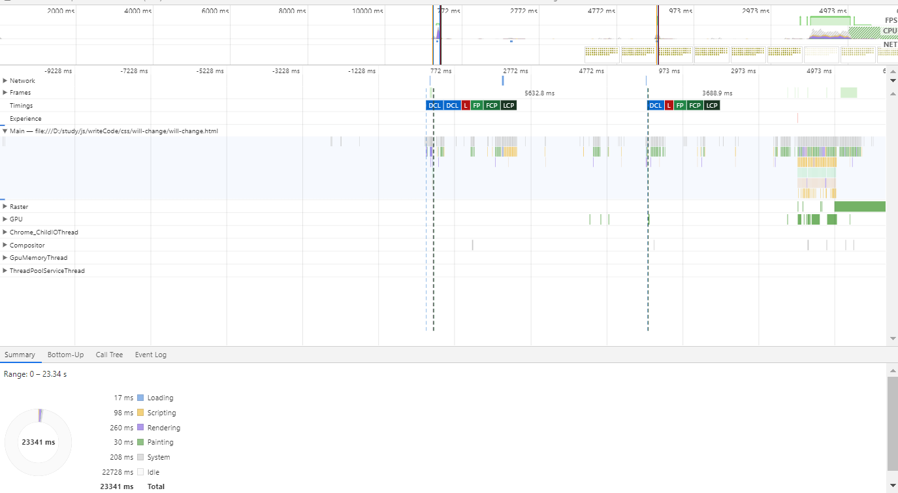
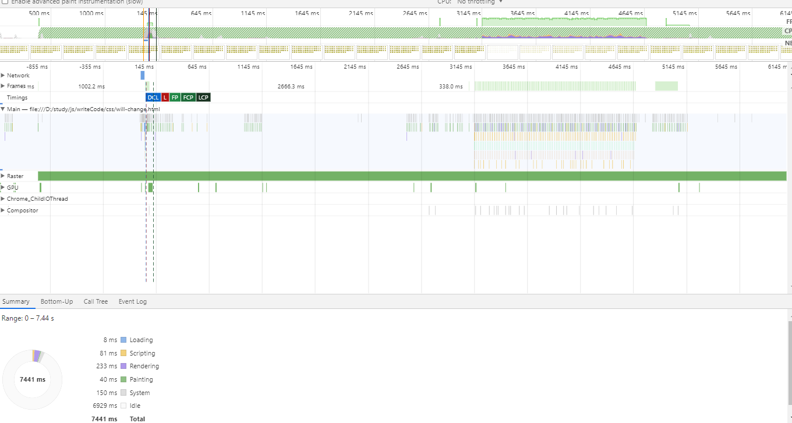

# will-change

 使用will-change，这段代码就是提前告诉渲染引擎 box 元素将要做几何变换和透明度变换操作，这时候渲染引擎会将该元素单独实现一帧，等这些变换发生时，渲染引擎会通过合成线程直接去处理变换，这些变换并没有涉及到主线程，这样就大大提升了渲染的效率。**这也是 CSS 动画比 JavaScript 动画高效的原因**。

## CPU、GPU和硬件加速

硬件加速意味着Graphics Processing Unit（GPU）会通过代替Central Processing Unit (CPU)做一些负荷比较大的事情，来协助浏览器快速渲染页面，当CSS操作使用硬件加速的时候，通常会使页面渲染速度加快

顾名思义，CPU和GPU都是计算机处理单元。CPU在电脑主板，几乎处理电脑的一切操作，有电脑大脑之称；GPU在显卡上，负责处理和渲染图形。此外GPU通过特殊的设计，使其擅长于渲染图形所需的数学和几何运算。因此把操作转嫁到GPU可以获得显著的性能提升，同时也可以减少移动设备CPU的争用。

硬件加速（或者说GPU加速）依赖于浏览器渲染页面使用的layering model，当特定的操作（CSS 3D变形）作用于页面上的一个元素，元素移动到它自己的layer，在这个layer中元素合一不受页面其他元素的干扰独立渲染，然后复合到页面中去。在这种隔离内容渲染的工作方式下，如果页面的变化仅仅是该元素的变形，其余部分不必被重新渲染，这会带来显著的速度优势。值得注意的是只有3D变形会有自己的layer，2D变形不会。

CSS的动画、变形、渐变并不会自动的触发GPU加速，而是使用浏览器稍慢的软件渲染引擎。然而一些浏览器提供了hardware acceleration by means of certain properties来获取更高的渲染性能。 举个例子，opacity属性是几个能够加速的属性之一，因为GPU可以方便的处理。基本上任何层的透明度渐变浏览器都会交给GPU处理来加速。除了opacity能够使用GPU处理的就是CSS 3D变形了

## Hack

通过translateZ()或者translate3d() hack来骗取浏览器触发硬件加速

## 什么都没加



 

## 增加will-change

``` css
 .box {
     will-change: transform, opacity;
 }
```



## 对比

两项数据分别是：

``` md
#no-will-change
loader: 17 ms
script: 98 ms
rendering: 260 ms
painting: 30 ms
```

``` md
#will-change
loader: 8 ms
script: 81 ms
rendering: 233 ms
painting: 40 ms
```

可以明显看出至少有10%以上的提升，什么都没加多增加了一轮重绘
在频繁触发动画的情况下，这个数据差距只会更加大

## 兼容性

兼容性并不乐观


